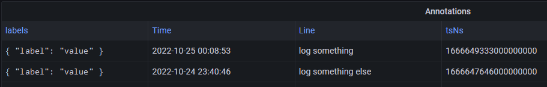

# PSLoki

PowerShell module for pushing log entries to Loki.

[](https://www.powershellgallery.com/packages/PSLoki) [](https://www.powershellgallery.com/packages/PSLoki)

> _:heavy_check_mark: See [CHANGELOG.md](CHANGELOG.md) for what's new!_



## Installation

Using the [latest version of PowerShellGet](https://www.powershellgallery.com/packages/PowerShellGet):

```powershell
Install-Module -Name PSLoki -Repository PSGallery -Scope CurrentUser -Force -PassThru
Import-Module -Name PSLoki -Force -PassThru
```

Or if you already have the module installed, update to the latest version:

```powershell
Update-Module -Name PSLoki
Import-Module -Name PSLoki -Force -PassThru
```

## Authentication

For use with e.g. Grafana Cloud you must have an account to access the API. Access tokens (_API Keys_) for Grafana can be generated at <https://grafana.com/orgs/[your-user-name]/api-keys>.

To authenticate, pass the generated access token using the [`-AccessToken`](docs/functions/Send-LokiLogEntry.md#-accesstoken) parameter with each call or set the `LOKI_ACCESS_TOKEN` environment variable:

```powershell
$env:LOKI_ACCESS_TOKEN = "<your access token>"
```

## Usage

Use `Get-Command -Module PSLoki` for a list of functions provided by this module. See the help associated with each function using the `Get-Help` command, e.g. `Get-Help Get-LokiLogEntry -Detailed`, and the documentation available [in `docs`](docs/functions/) for more details:

- [`Get-LokiTimestamp`](docs/functions/Get-LokiTimestamp.md)
- [`Send-LokiLogEntry`](docs/functions/Send-LokiLogEntry.md)

### Examples

#### Get Unix Epoch for current date/time

```powershell
$timestamp = Get-LokiTimestamp
Write-Host "Current Unix Epoch (in nanoseconds) is: $timestamp"
```

#### Send log entries to Loki

```powershell
$labels = @{
    'label' = 'value'
    'foo'   = 'bar'
}
$logEntries = @(
    @{
        time = "1666644815000000000"
        line = "log something"
    }
    @{
        time = "1666644823000000000"
        line = "log something else"
    }
)
$response = Send-LokiLogEntry -Labels $labels -Entries $logEntries
Write-Host "Log entries sent to Loki [$($response.StatusCode) $($response.StatusDescription)]"
```

### Debugging

To view the actual Loki log entries sent in the requests, add the `-Debug` switch to the command.

Example:

```powershell
PS> Send-LokiLogEntry -Labels $labels -Entries $logEntries -Debug
DEBUG: Invoking web request: POST https://logs-prod-us-central1.grafana.net/loki/api/v1/push
DEBUG: Loki log entries: {
  "streams": [
    {
      "values": [
        [
          "1666644815000000000",
          "log something"
        ],
        [
          "1666644823000000000",
          "log something else"
        ]
      ],
      "stream": {
        "label": "value",
        "foo": "bar"
      }
    }
  ]
}
```
